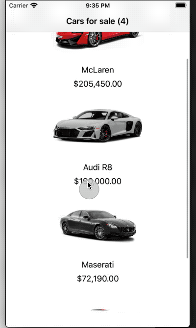

#  ParallelUI Tests

A sample project that showcases how to run UI tests in parallel both locally and in a CI/CD environment

## App

## Parallel UI Execution

## Requirements

* Xcode 11.7
* iOS 13+

## Notes

If cloning don't forget to change the bundle ID!.

